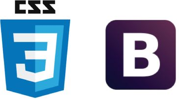

# PiioApp

          
### Based on EasyRTC

## 1st Team Project (University of Lodz, WMII)
##### Authors: Michał Żakowski , Damian Henisz, Adam Wójcik

## Begin:

### Piio is our first Web-app based on EasyRTC. For demo visit https://176.107.131.238 (I think this side is alive, yet :P ). This is simple web chat app with live canvas like MS paint.


## Quick Setup:
0. You must have Node.js / if you have not, go to -> https://nodejs.org/en/ then download  and install (we recomend LTS version)
1. Open Terminal
2. Enter:
```sh
$ git clone https://github.com/ckrewone/TeamProject.git
$ cd TeamProject/html
$ npm install
$ cd server
$ node server.js
```
3. Should go on https://localhost/ .

## Peace :D
